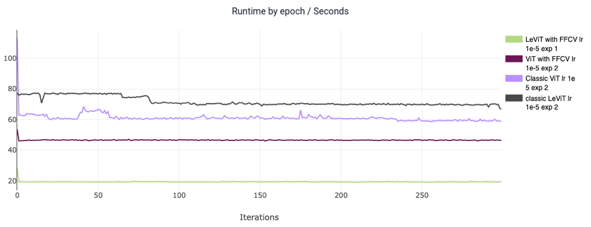
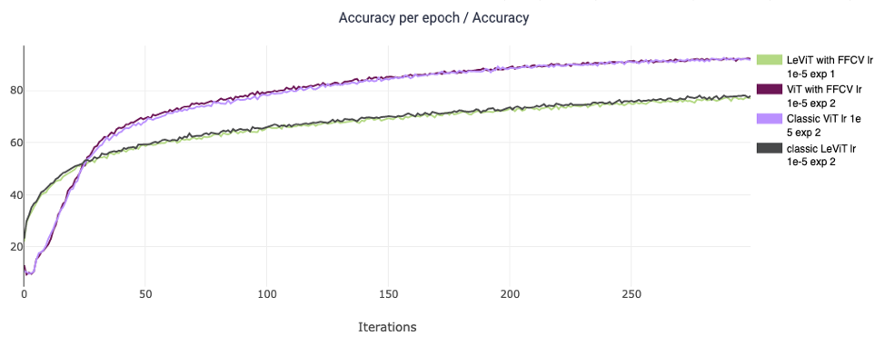
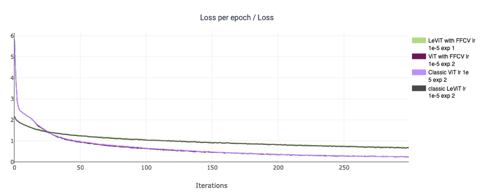

# `ffcv` ViT and LeViT Training
- ...achive same model's performance at a fraction of the training time.


## Results
Train transformers more efficiently,

first, we can see that by incorporating FFCV into models can significantly shorten the training times.
Up to 20% reduction of training time for ViT and Up to 75% reduction of training time for LeViT




second, the performance of the network didn’t suffer any hindrance due to the incorporation of FFCV.

* same accuracy performance



* same loss performance




## Configurations
The configuration files corresponding to the above results are:


## Training Models

First pip install the requirements file in this directory:
```
conda create -n ffcv python=3.9 cupy pkg-config compilers libjpeg-turbo opencv pytorch torchvision cudatoolkit=11.3 numba -c pytorch -c conda-forge
conda activate ffcv
pip install ffcv
pip install -r requirements.txt
```

### Format the data set.   
```bash
# Required environmental variables for the script: 
export DATA_DIR=/path/to/pytorch/format/data/directory/
export WRITE_DIR=/path/to/where/you/want/to/save/the/data
```

`DATA_DIR` should point to a PyTorch style [ImageNet dataset](https://github.com/MadryLab/pytorch-imagenet-dataset):

We want both the train and val to be in this format:   
```    
train/
  n01443537/
    images/
      n02058221_0.JPEG
  ...
```   
```bash
# Starting in the root of the Git repo:

# Serialize images with:
# - 500px side length maximum
# - 50% JPEG encoded
# - quality=90 JPEGs
./write_imagenet.sh 500 0.50 90
```
Adjust the configuration by changing the settings file.

## Training Details
<p><b>System setup.</b> We trained on RTX 2080Ti
</p>

<p><b>Dataset setup. Generally larger side length will aid in accuracy but decrease
throughput:</b>

 - all ViT training: 50% JPEG 500px side length (ViT base and LeViT 128S)

</p>


<p><b>Algorithmic details.</b> 

- ADAM optimizer learning rate 1e-5

</p>

Refer to the code and configuration files for a more exact specification.


## FAQ
### Why is the first epoch slow?
The first epoch might be slower if the dataset hasn't been cached in memory yet.

### What if I can't fit my dataset in memory?
See this [guide here](https://docs.ffcv.io/parameter_tuning.html#scenario-large-scale-datasets).

# we are attempting to improve the training time of Transformers using the ideas from https://github.com/libffcv/ffcv-imagenet
